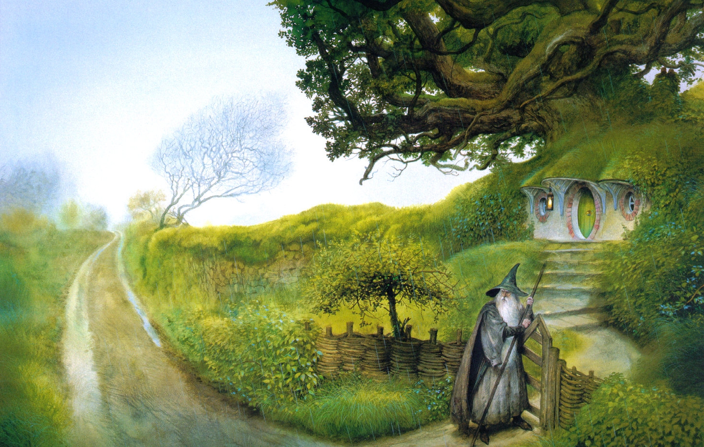

Forecasting Member Outcomes at Omada
-----

In my current role as a researcher at Omada, a digital chronic health management company, I worked to forecast 
our pre-diabetic member's outcomes. This task is challenging given the unpredictability 
of behavior change but critical because our business model charges 
people based on their health outcomes. It got even harder in 2020 when new accounting
requirements were released and we extended this model to work for them. We must

It required two major model iterations, then building it into our 
production systems, then extending our ETL to manage data from multiple runs.

# Original model

* Finding features
* Establishing a standard approach for our team
* Splitting the model for people who hadn't beein the in the program
* Going to an individual level

# Reworked model

 
# Extending logos

* Extending Logos
* Helping build S3_extract model

##OLD

