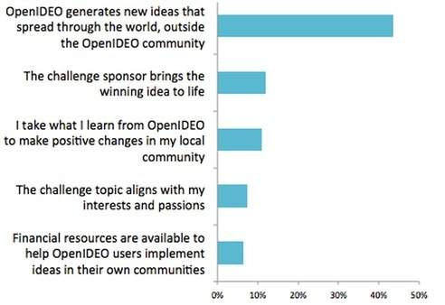

OpenIDEO Hybrid Insights Research
-----

*Top Ideas from Chicago's Winter Dining Challenge*

[OpenIDEO](https://www.openideo.com/) puts the power of human-centered design in the hands of many through a 
crowdsourced innovation platform. As a Community Designer and then Product Manager
there, I co-led a mixed methods research study to help us better understand it's impact with [Juliette Melton](https://www.juliettemelton.com/).
She led the qualitative research and I led the quantitative analysis.

 We built an understanding of segments of our community both as individuals as well as through 
 broader patterns of behaviors, attitudes and needs. 
 One way to think of it is that the Hybrid Insights approach combines 
 both stories and numbers to allow for a richer understanding of the 
 OpenIDEO community.
 
 The Hybrid Insights approach starts with conversation.
  We began by talking with community members who have been involved with 
  OpenIDEO in different ways. We learned about how they discovered OpenIDEO, 
  what it means for them in your lives and careers, and what impact they
  hope to see from it.

One story we kept hearing was how people are working on OpenIDEO challenges 
in their communities, with friends and through social networks. 
We wanted to understand the ways that they are engaging with OpenIDEO 
that we aren't able to measure through traditional website metrics, 
since they are happening off-platform.
 
As we continued our research project through a survey, 
we made sure to ask about this kind of engagement and learned that 
it's widespread. Of the survey respondents, 
80% have done some kind of off-platform engagement. 
Some examples were: student projects, grant applications,
 meetups and OpenSTORMS. 
 Knowing this, we're exploring how we might 
 take some of the great enthusiasm, 
 collaboration and community from the OpenIDEO site through to global, 
 off-platform interactions to drive further impact.
 
In the survey we also explored OpenIDEO's impact in the world. 
We asked, "Looking forward, what do you most hope to see from OpenIDEO?" 
and provided sets of statements that respondents prioritised. 
Out of ten statements, the responses show a clear 
preference for the statement "OpenIDEO generates 
new ideas that spread through the world, outside the OpenIDEO community."

  
At first glance, this statement ranks so much higher that it would be tempting to focus solely on it.
 But when we used clustering tools to look for patterns in how 
 people prioritised impact, we saw 
 four types of community members emerge around the top four 
 impact statements listed above. Of these types of respondents, 
 the largest group did favor "OpenIDEO generates new ideas that 
 spread through the world," but the other three groups didn’t. 
 We wanted to learn more about these other groups.
 
This is where things got interesting. We had another quantitative
 data set at our disposal: actual onsite behaviour for 
 registered users across the last 19 challenges. 
 We combined this data with the survey results data, 
 allowing us to understand how the same people were 
 using the site and also how they talked about their 
 involvement in the survey. And for some of them, 
 we also had one-on-one conversations. 
 This is a powerful combination that gets to the
  heart of the Hybrid Insights approach; 
  we could understand the attitudes, behaviours,
   and your needs through statistical pattern finding and 
   personal stories, allowing for both confidence in our 
   findings and empathy with our research participants.
 
As we looked across the four groups and how each of them used the site and responded to questions about engagement and impact, we could understand how the groups were different and what mattered to them.
 
We found that the group that preferred "The challenge sponsor brings the winning idea to life" contributes twice as many ideas than average and is more likely than others to give applause to someone else's statement or to write comments. Overall, they were the most invested in the site and had the highest standards for seeing ideas come to life.
 
The group that preferred "I take what I learn from OpenIDEO to make positive changes in my local community" includes people who are more active in their communities than the others, and more of them are talking about the challenge on social media than the people in the other groups. We’re now curious what value this group gets on our platform for their community actions.
 
These nuanced profiles serve as a reminder of the diversity of the OpenIDEO community and the importance of understanding what people want to get out of the OpenIDEO experience. They also help the OpenIDEO team understand how to prioritise building new features and how to communicate with the community.
 
