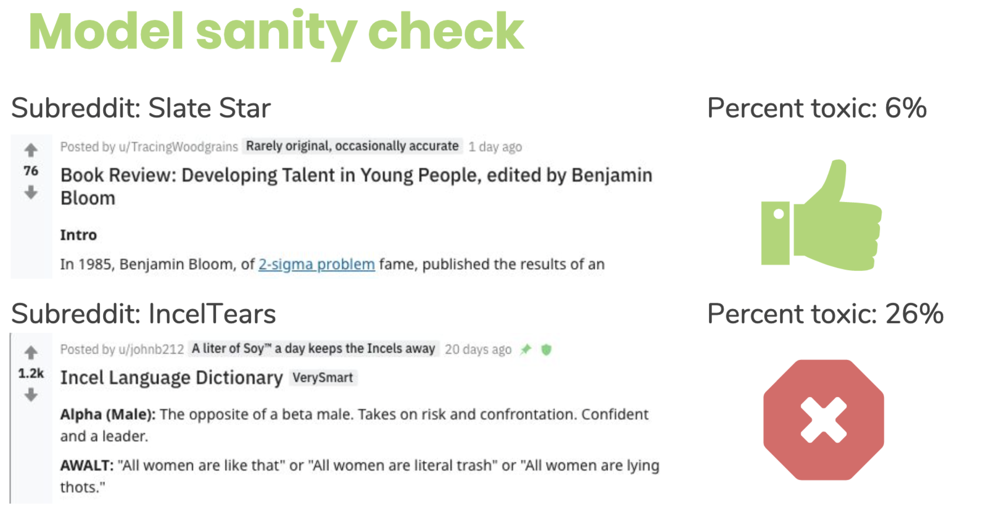

Preventing Online Harassment on Reddit
-----

"Roughly four-in-ten Americans have 
personally experienced online harassment, and 62% consider it a major problem."
[Pew](https://www.pewresearch.org/internet/2017/07/11/online-harassment-2017/)

Having spent most of my career on digital platforms helping people connect, online harassment 
is a big issue I wanted to help tackle. When working on a NLP project I picked this issue
given a good starting dataset from [Wikipedia](https://www.kaggle.com/c/jigsaw-toxic-comment-classification-challenge).
I showcased how platforms like Reddit could score text based on toxicity and help people
prevent or monitor messages that may contain harassment.

Look through [my presentation](https://github.com/NathanMaton/prevent_harassment/blob/master/Presentation.pdf) for more details on the NLP techniques used and potential applications.

